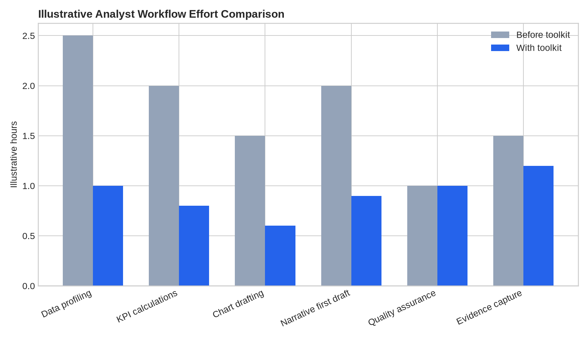
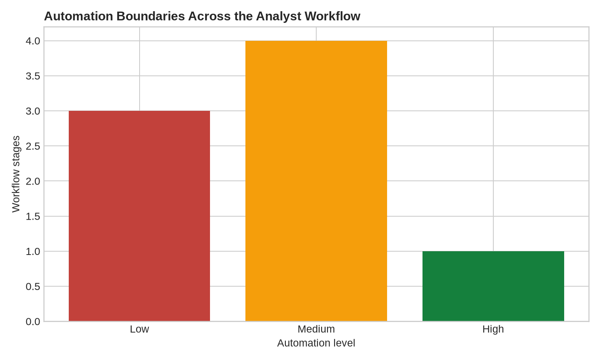

# AI-Powered Data Analyst Toolkit

> Practical operating system for analysts combining data workflows, AI prompts, quality controls, and reusable reporting templates.

## Business Problem

Analysts lose time repeating low-value setup work. The toolkit standardizes common analyst workflows while keeping validation and human judgment explicit.

## Analytical Questions

- Which analyst tasks can be standardized safely?
- Where does AI accelerate work without weakening quality?
- Which checks must remain human-controlled?
- Which outputs can become reusable assets?

## Deliverables

- Data-cleaning workflow
- KPI-analysis workflow
- EDA checklist
- AI prompt modules
- Report skeleton
- QA checklist
- Reusable templates

## Suggested Repository Structure

```text
ai-powered-data-analyst-toolkit/
├── data/
├── notebooks/
├── src/
├── tests/
├── outputs/
├── README.md
└── requirements.txt
```

## Stack

Python, pandas, SQL, Markdown, JSON, prompt templates, GitHub Actions-ready structure

## Method

1. Define the decision context and metric definitions.
2. Profile and validate the data.
3. Build reproducible transformations and calculations.
4. Quantify the main drivers, scenarios, or failure modes.
5. Validate outputs and document limitations.
6. Produce an executive-ready decision narrative.

## Portfolio Standard

Use synthetic or public data with documented provenance. Clearly distinguish measured results from assumptions and illustrative scenarios.

## Sample Outputs

Run `python src/generate_outputs.py` to reproduce the illustrative analyst workflow comparison. Time values are planning assumptions, not observed productivity benchmarks.

### Executive summary

See [`outputs/executive_summary.md`](outputs/executive_summary.md) for the operating model and human-control boundaries.





- [`data/workflow_stages.csv`](data/workflow_stages.csv) — workflow stages and control ownership
- [`outputs/workflow_effort_comparison.csv`](outputs/workflow_effort_comparison.csv) — illustrative effort comparison
- [`outputs/qa_checklist.csv`](outputs/qa_checklist.csv) — reusable QA checklist
